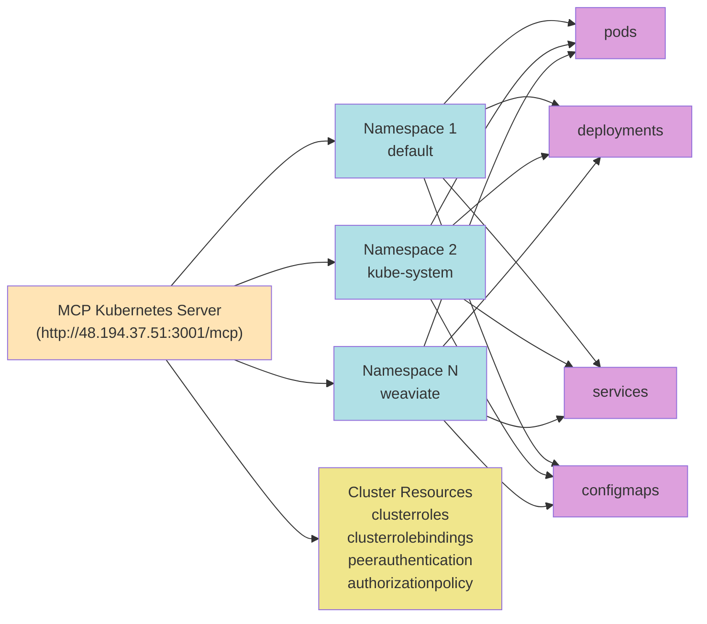
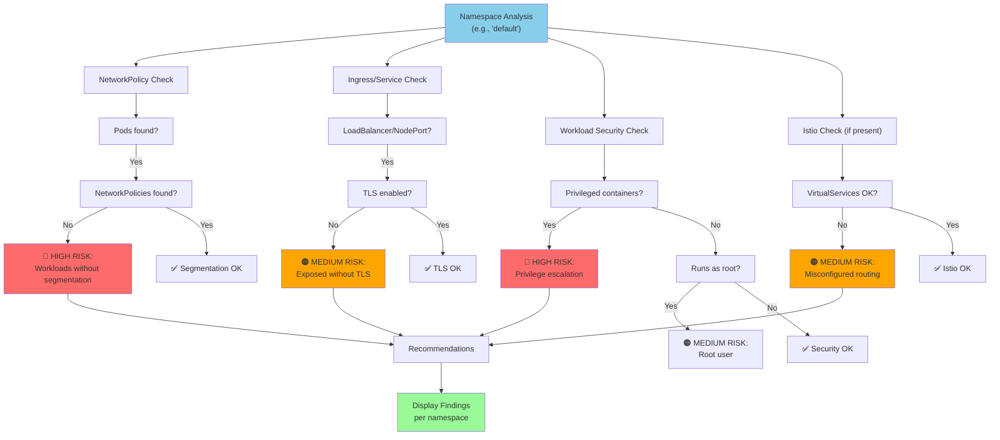
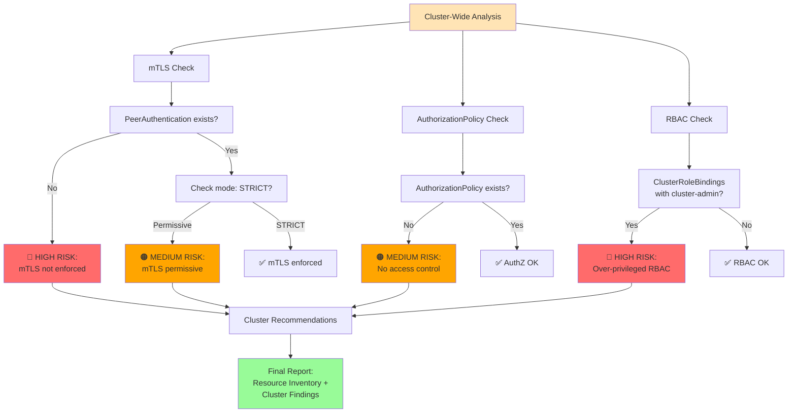
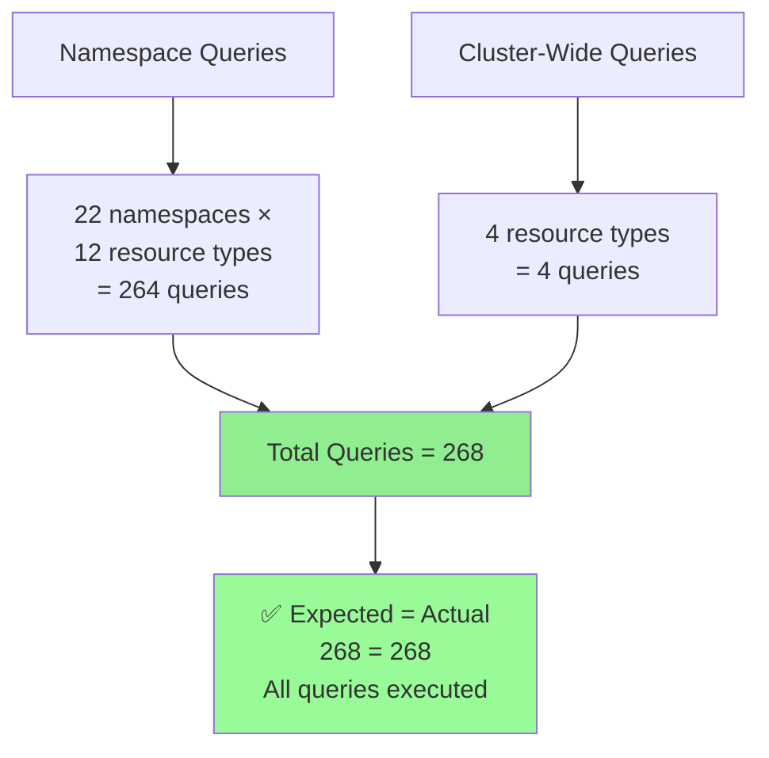
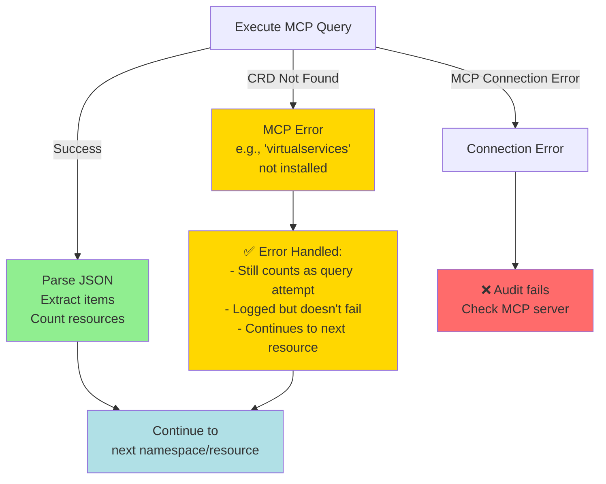

# Comprehensive Security Audit - Architecture Diagram

## High-Level Flow

```mermaid
graph TD
    A["🚀 START: run_comprehensive_auditor"] --> B["STAGE 1: Namespace Discovery"]
    
    B --> B1["Initialize LLM Graph"]
    B1 --> B2["Send Query: 'Get all namespaces'"]
    B2 --> B3["LLM calls kubectl_get tool"]
    B3 --> B4["Parse response → Extract namespace list"]
    B4 --> B5["✅ Found 22 namespaces"]
    
    B5 --> C["STAGE 2: Resource Inventory Query"]
    
    C --> C1["Initialize MCP Client"]
    C1 --> C2["For each namespace..."]
    C2 --> C3["Query 12 resource types per namespace"]
    C3 --> C4["Gather: pods, deployments, services, ingresses, etc."]
    
    C4 --> C5["Query cluster-wide resources"]
    C5 --> C6["Gather: clusterroles, clusterrolebindings, peerauthentication, authorizationpolicy"]
    C6 --> C7["✅ Executed 268 total queries"]
    
    C7 --> D["PER-NAMESPACE ANALYSIS"]
    D --> D1["For each namespace..."]
    D1 --> D2["Analyze NetworkPolicy coverage"]
    D2 --> D3["Check Ingress/Service exposure"]
    D3 --> D4["Inspect workload security contexts"]
    D4 --> D5["Detect Istio misconfigs"]
    D5 --> D6["Collect findings"]
    D6 --> D7["Display per-namespace report"]
    
    D7 --> E["CLUSTER-WIDE ANALYSIS"]
    E --> E1["Check mTLS/PeerAuthentication"]
    E1 --> E2["Check AuthorizationPolicy"]
    E2 --> E3["Check RBAC (cluster-admin)"]
    E3 --> E4["Collect cluster findings"]
    E4 --> E5["Display cluster report"]
    
    E5 --> F["✅ COMPREHENSIVE AUDIT COMPLETE"]
    
    style A fill:#90EE90
    style B fill:#87CEEB
    style C fill:#87CEEB
    style D fill:#FFB6C1
    style E fill:#FFB6C1
    style F fill:#90EE90
```



## Detailed Query Flow



## Per-Namespace Security Analysis



## Cluster-Wide Security Analysis



## Query Count Tracking



## Error Handling



## Resource Types Queried

```
Per-Namespace (12 types):
├── Workloads
│   ├── pods
│   ├── deployments
│   ├── daemonsets
│   └── statefulsets
├── Security
│   ├── rolebindings
│   └── networkpolicies
├── Networking
│   ├── services
│   └── ingresses
├── Istio (if installed)
│   ├── virtualservices
│   ├── destinationrules
│   └── gateways
└── Config
    └── configmaps

Cluster-Wide (4 types):
├── clusterroles
├── clusterrolebindings
├── peerauthentication
└── authorizationpolicy
```

## Output Structure

```
📊 COMPREHENSIVE SECURITY AUDIT
│
├── 📦 NAMESPACE: default
│   ├── Resource Table (counts & status)
│   ├── Resource Details (pods, deployments, etc.)
│   ├── 🔒 SECURITY FINDINGS (per namespace)
│   │   ├── 🔴 HIGH RISK (e.g., no NetworkPolicies)
│   │   ├── 🟠 MEDIUM RISK (e.g., missing TLS)
│   │   └── 💡 RECOMMENDATIONS (e.g., add default-deny policies)
│   └── ---
│
├── 📦 NAMESPACE: kube-system
│   └── (same structure as above)
│
├── ... (20 more namespaces)
│
├── 🔒 CLUSTER-WIDE SECURITY ASSESSMENT
│   ├── 🔴 HIGH RISK (e.g., no mTLS)
│   ├── 🟠 MEDIUM RISK (e.g., no AuthorizationPolicy)
│   └── 💡 RECOMMENDATIONS
│
└── SUMMARY
    ├── Namespaces found: 22
    ├── Expected queries: 268
    ├── Actual queries: 268
    └── ✅ SUCCESS!
```

## Key Features

| Feature | Description |
|---------|-------------|
| **Stage 1** | LLM-driven namespace discovery via MCP |
| **Stage 2** | Direct MCP queries for all resources |
| **Per-Namespace** | Individual security analysis with findings |
| **Cluster-Wide** | Mesh/cluster-level policy checks |
| **Error Handling** | Missing CRDs logged, audit continues |
| **Resource Coverage** | 12 namespace + 4 cluster resources = 268 total queries |
| **Standards Mapping** | NIST, CIS, NSA/CISA compliance references |
| **Findings** | HIGH/MEDIUM/LOW risk with recommendations |

